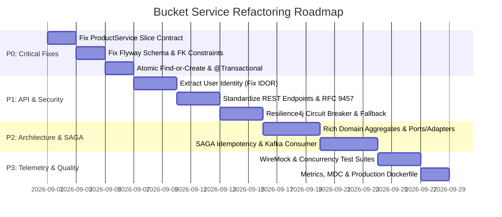

# 🏗️ Production-Grade Refactoring Plan: Bucket Service

> **Target:** Transform `BucketService` into an enterprise-ready, highly resilient, secure, high-performance, and maintainable microservice.

---

## 📑 Table of Contents
1. [Executive Summary & Gap Analysis](#1-executive-summary--gap-analysis)
2. [Current Architecture vs. Target Architecture](#2-current-architecture-vs-target-architecture)
3. [Phase 1: Architecture & Clean Domain Modeling](#3-phase-1-architecture--clean-domain-modeling)
4. [Phase 2: RESTful API & Contract Standardization](#4-phase-2-restful-api--contract-standardization)
5. [Phase 3: Database, Transactions & Data Integrity](#5-phase-3-database-transactions--data-integrity)
6. [Phase 4: Resilient Downstream Integration (Product Service & SAGA)](#6-phase-4-resilient-downstream-integration-product-service--saga)
7. [Phase 5: Security & Identity Governance](#7-phase-5-security--identity-governance)
8. [Phase 6: Observability, Telemetry & Performance](#8-phase-6-observability-telemetry--performance)
9. [Phase 7: Quality Assurance & Testing Strategy](#9-phase-7-quality-assurance--testing-strategy)
10. [Phase 8: DevOps, Containerization & CI/CD](#10-phase-8-devops-containerization--cicd)
11. [Prioritized Implementation Roadmap (P0 to P3)](#11-prioritized-implementation-roadmap-p0-to-p3)

---

## 1. Executive Summary & Gap Analysis

The current **Bucket Service** provides a working foundation for shopping cart management with PostgreSQL persistence, Eureka service discovery, Zipkin tracing, and initial integration tests. However, critical gaps in **data integrity**, **concurrency handling**, **external service resilience**, **REST semantics**, **security**, and **observability** separate it from being a resilient, production-ready microservice.

### 📊 Maturity Scorecard

| Dimension | Current State | Target (Perfect Service) | Gap Level |
| :--- | :--- | :--- | :--- |
| **Domain Architecture** | Anemic records, package casing violation, tight coupling | Rich Domain Model, Clean/Hexagonal Architecture | 🟡 Medium |
| **API Design** | Non-standard DELETE decrement, void responses, missing validation | RESTful RFC 9457 standards, rich response DTOs, strict Jakarta validation | 🔴 High |
| **Data & Concurrency** | Race condition in cart creation, no FK constraints, missing `@Transactional` | Atomic upserts, FK cascades, optimistic locking, strict transactions | 🔴 High |
| **Downstream Resilience** | Synchronous `RestTemplate`, contract mismatch with `ProductService`, non-idempotent SAGA restore | Non-blocking/Resilient `RestClient`/Feign + Resilience4j (CB, Retry, Fallback), idempotent SAGA | 🔴 Critical |
| **Security** | Unauthenticated, IDOR vulnerability (client ID in path without token validation) | OAuth2/JWT context-driven identity, gateway header validation, RBAC | 🔴 Critical |
| **Observability** | Basic logs without MDC context, default Actuator metrics | Structured JSON logs + MDC correlation, custom Micrometer metrics, custom health indicators | 🟡 Medium |
| **Testing** | 1 integration test file, mock RestTemplate, no unit/contract/concurrency tests | 90%+ Unit test coverage, Testcontainers, WireMock contract tests, concurrency tests | 🔴 High |
| **DevOps & Config** | Basic single-stage Dockerfile, hardcoded DB credentials fallback | Multi-stage distroless/alpine non-root container, layered JARs, full compose stack | 🟡 Medium |

---

## 2. Current Architecture vs. Target Architecture

```mermaid
flowchart TD
    subgraph Current Architecture
        A1[Client / Gateway] -->|Passes clientId in URL| B1[BucketController]
        B1 --> C1[BucketService]
        C1 -->|Raw RestTemplate call| D1[Product Service]
        C1 -->|No @Transactional| E1[(PostgreSQL)]
        C1 -.->|Non-idempotent /restore| F1[SAGA Orchestrator]
    end

    subgraph Target Architecture (Production Ready)
        A2[Client / Gateway] -->|JWT / X-User-Id Header| B2[BucketController]
        B2 -->|Input Validation & Mapping| C2[BucketApplicationService]
        C2 -->|Enforces Invariants| D2[Domain Aggregate: Bucket]
        C2 -->|Resilience4j CB + Retry + Fallback| E2[ProductCatalogClient]
        E2 -->|Feign / Modern RestClient| F2[Product Service]
        C2 -->|@Transactional + Optimistic Lock| G2[BucketRepository / Flyway]
        G2 --> H2[(PostgreSQL)]
        I2[Event Broker / Kafka] -->|Idempotent SAGA Events| J2[CartEventConsumer]
        J2 --> C2
    end
```

---

## 3. Phase 1: Architecture & Clean Domain Modeling

### 1.1 Package Naming & Structure Alignment
* **Current:** `package com.serjnn.BucketService;` (capital `B` violates Java conventions).
* **Refactor:** Normalize to standard lowercase: `com.serjnn.bucketservice`.
* **Clean Layering Structure:**
  ```text
  com.serjnn.bucketservice/
  ├── domain/
  │   ├── model/           # Rich aggregates: Bucket, CartItem, Money
  │   ├── exception/       # Domain exceptions
  │   └── repository/      # Domain Repository interfaces (Ports)
  ├── application/
  │   ├── dto/             # Request/Response records & commands
  │   ├── port/            # Inbound/Outbound port definitions
  │   └── service/         # Use-case application services
  ├── infrastructure/
  │   ├── client/          # Product service HTTP adapter + Resilience4j fallback
  │   ├── persistence/     # Spring Data JDBC / JdbcTemplate repository implementations
  │   ├── messaging/       # Kafka / SAGA event consumers and producers
  │   └── config/          # Spring beans, OpenAPI, Security, Metrics configs
  └── presentation/
      ├── controller/      # REST API Controllers
      └── advice/          # Global Exception Handler & ProblemDetails
  ```

### 1.2 Rich Domain Model vs. Anemic Records
* **Current:** `Bucket` and `BucketItem` are bare records with no business logic.
* **Target:** Encapsulate shopping cart invariants inside a domain model:
  - Maximum items per cart (e.g., max 100 items).
  - Maximum quantity per line item (e.g., max 20 per product).
  - Price & quantity calculations (subtotal, item counts).
  - Validations (non-negative quantities, non-null product IDs).

```java
public class Bucket {
    private final Long id;
    private final Long clientId;
    private final Map<Long, BucketItem> items;
    private Long version; // Optimistic locking

    public void addProduct(Long productId, int quantity, int maxQuantityPerItem) {
        if (quantity <= 0) throw new InvalidQuantityException("Quantity must be positive");
        items.compute(productId, (id, existing) -> {
            if (existing == null) {
                return new BucketItem(this.id, productId, quantity);
            }
            int newQty = existing.getQuantity() + quantity;
            if (newQty > maxQuantityPerItem) {
                throw new CartLimitExceededException("Cannot exceed " + maxQuantityPerItem + " units per item");
            }
            return existing.withQuantity(newQty);
        });
    }

    public void removeOrDecrement(Long productId, int quantity) {
        if (!items.containsKey(productId)) {
            throw new ItemNotFoundInBucketException(productId);
        }
        BucketItem item = items.get(productId);
        if (item.getQuantity() <= quantity) {
            items.remove(productId);
        } else {
            items.put(productId, item.withQuantity(item.getQuantity() - quantity));
        }
    }
}
```

### 1.3 Modern HTTP Client Adoption
* **Current:** Deprecated `RestTemplate` directly inside `BucketService`.
* **Refactor:** Migrate to Spring Boot 3 `RestClient` or `Spring Cloud OpenFeign` with declarative interfaces, connection pools, and automatic load balancing.
* **Type-Safe Configuration:** Replace raw `@Value` strings with `@ConfigurationProperties(prefix = "services.product")`.

---

## 4. Phase 2: RESTful API & Contract Standardization

### 4.1 REST Semantics & Endpoint Cleanup

| Current Endpoint | Method | Issue | Recommended Target | Target Method | Description |
| :--- | :--- | :--- | :--- | :--- | :--- |
| `/{clientId}/products/{productId}` | `POST` | Fixed increment by 1, returns `void` | `/api/v1/buckets/items` | `POST` | Body: `{ productId, quantity }`. Returns `200 OK` with updated `BucketResponseDto`. |
| `/{clientId}/products/{productId}` | `DELETE` | **Violates REST**: silently decrements quantity by 1 | `/api/v1/buckets/items/{productId}` | `PATCH` / `PUT` | Body: `{ quantity }` or `{ delta: -1 }`. Updates quantity. |
| `/{clientId}/products/{productId}` | `DELETE` | *Missing full delete* | `/api/v1/buckets/items/{productId}` | `DELETE` | Removes item entirely from bucket regardless of quantity. Returns `204 No Content`. |
| `/{clientId}` | `DELETE` | Returns `200 OK` void | `/api/v1/buckets` | `DELETE` | Clears cart. Returns `204 No Content`. |
| `/{clientId}` | `GET` | Returns `List<CompleteProductDto>` | `/api/v1/buckets` | `GET` | Returns rich `BucketResponseDto` (subtotal, totalItems, items list). |
| `/restore` | `POST` | Raw body, non-idempotent | `/api/v1/buckets/restore` | `POST` | Header: `X-Idempotency-Key` / Saga ID. Idempotent restoration. |

### 4.2 Comprehensive Jakarta Validation
Apply strict validation annotations across all incoming request parameters and bodies:
- `@Positive(message = "Product ID must be greater than 0")`
- `@Min(value = 1, message = "Quantity must be at least 1")`
- `@Max(value = 99, message = "Quantity cannot exceed 99 units")`
- `@NotNull`, `@NotEmpty`, `@Valid` on complex objects.

### 4.3 Standardized Problem Details (RFC 9457)
Implement `@RestControllerAdvice` leveraging Spring Boot 3 `ProblemDetail`:

```java
@RestControllerAdvice
public class GlobalExceptionHandler extends ResponseEntityExceptionHandler {

    @ExceptionHandler(BucketNotFoundException.class)
    public ProblemDetail handleNotFound(BucketNotFoundException ex) {
        ProblemDetail problem = ProblemDetail.forStatusAndDetail(HttpStatus.NOT_FOUND, ex.getMessage());
        problem.setTitle("Bucket Not Found");
        problem.setType(URI.create("https://api.shop.com/errors/not-found"));
        problem.setProperty("timestamp", Instant.now());
        return problem;
    }

    @ExceptionHandler(ProductServiceUnavailableException.class)
    public ProblemDetail handleDownstreamError(ProductServiceUnavailableException ex) {
        ProblemDetail problem = ProblemDetail.forStatusAndDetail(HttpStatus.SERVICE_UNAVAILABLE, ex.getMessage());
        problem.setTitle("Catalog Service Unavailable");
        problem.setProperty("timestamp", Instant.now());
        return problem;
    }
}
```

---

## 5. Phase 3: Database, Transactions & Data Integrity

### 5.1 Flyway Migration Refactoring

#### Critical Schema Bugs in Current Migrations:
1. **Creation order:** `V1` creates `bucket_item` referencing `bucket_id` before `bucket` table is created in `V2`.
2. **Missing Foreign Keys:** No `FOREIGN KEY (bucket_id) REFERENCES bucket(id) ON DELETE CASCADE`.
3. **Primary Key Data Type:** Uses `SERIAL` (32-bit int) while Java model uses `Long` (64-bit). Use `BIGINT GENERATED ALWAYS AS IDENTITY`.
4. **Missing Indexes:** Index missing on `bucket_item(bucket_id)`.
5. **Missing Audit & Concurrency Fields:** Missing `created_at`, `updated_at`, and `version` columns.

#### Target Migration (`V1__init_bucket_schema.sql`):
```sql
CREATE TABLE bucket (
    id BIGINT GENERATED ALWAYS AS IDENTITY PRIMARY KEY,
    client_id BIGINT UNIQUE NOT NULL,
    version BIGINT NOT NULL DEFAULT 0,
    created_at TIMESTAMP WITH TIME ZONE NOT NULL DEFAULT CURRENT_TIMESTAMP,
    updated_at TIMESTAMP WITH TIME ZONE NOT NULL DEFAULT CURRENT_TIMESTAMP
);

CREATE TABLE bucket_item (
    id BIGINT GENERATED ALWAYS AS IDENTITY PRIMARY KEY,
    bucket_id BIGINT NOT NULL,
    product_id BIGINT NOT NULL,
    quantity INT NOT NULL CHECK (quantity > 0),
    created_at TIMESTAMP WITH TIME ZONE NOT NULL DEFAULT CURRENT_TIMESTAMP,
    updated_at TIMESTAMP WITH TIME ZONE NOT NULL DEFAULT CURRENT_TIMESTAMP,
    CONSTRAINT fk_bucket_item_bucket FOREIGN KEY (bucket_id) 
        REFERENCES bucket(id) ON DELETE CASCADE,
    CONSTRAINT uq_bucket_item_product UNIQUE (bucket_id, product_id)
);

CREATE INDEX idx_bucket_client_id ON bucket(client_id);
CREATE INDEX idx_bucket_item_bucket_id ON bucket_item(bucket_id);
```

### 5.2 Atomic "Find-or-Create" (Eliminate Race Condition)
* **Current:** Java code catches generic `Exception` when multiple threads attempt to create a bucket for the same client.
* **Refactor:** Use PostgreSQL atomic upsert:
```sql
INSERT INTO bucket (client_id, created_at, updated_at)
VALUES (:clientId, CURRENT_TIMESTAMP, CURRENT_TIMESTAMP)
ON CONFLICT (client_id) DO UPDATE SET updated_at = CURRENT_TIMESTAMP
RETURNING id, client_id, version, created_at, updated_at;
```

### 5.3 Declarative Transaction Management
* Add `@Transactional(readOnly = true)` at class level for `BucketService`.
* Add `@Transactional` with appropriate rollback rules on write operations (`addProduct`, `removeProduct`, `clearBucket`, `restore`).

### 5.4 Elimination of N+1 Queries
* In `BucketItemRepository.deleteAll(List<BucketItem> items)`: current code executes a loop of individual `DELETE FROM bucket_item WHERE id = ?` queries.
* Replace with a single query: `DELETE FROM bucket_item WHERE bucket_id = :bucketId`.

---

## 6. Phase 4: Resilient Downstream Integration (Product Service & SAGA)

### 6.1 Fixing Downstream Contract Mismatch
* **Bug Discovery:** `ProductService` returns `Slice<Product>` (paginated JSON containing `content`, `pageable`, `size`), but `BucketService` uses `RestTemplate` expecting raw `List<ProductDto>`.
* **Fix:** Define an internal `ProductPageResponse<T>` / `SliceResponse<T>` or update the ProductService client contract to parse slices properly:
```java
public record ProductSliceResponse(List<ProductDto> content, boolean hasNext) {}
```

### 6.2 Resilience4j Circuit Breaker, Retry & Fallback
Protect against cascading failures when `ProductService` is slow or unavailable:

```yaml
resilience4j:
  circuitbreaker:
    instances:
      productService:
        sliding-window-size: 20
        failure-rate-threshold: 50
        wait-duration-in-open-state: 10s
        permitted-number-of-calls-in-half-open-state: 5
  retry:
    instances:
      productService:
        max-attempts: 3
        wait-duration: 500ms
        enable-exponential-backoff: true
  timelimiter:
    instances:
      productService:
        timeout-duration: 2s
```

#### Fallback Strategy:
If `ProductService` fails, return cart items with placeholder metadata (e.g. `"[Product details temporarily unavailable]"`) rather than returning an HTTP 500 and blocking user cart access:
```java
@CircuitBreaker(name = "productService", fallbackMethod = "fetchProductsFallback")
public List<ProductDto> fetchProducts(List<Long> productIds) { ... }

public List<ProductDto> fetchProductsFallback(List<Long> productIds, Throwable t) {
    log.warn("Product service unavailable. Returning fallback metadata for IDs {}", productIds, t);
    return productIds.stream()
        .map(id -> new ProductDto(id, "Product #" + id, "Information temporarily unavailable", BigDecimal.ZERO, "UNKNOWN"))
        .toList();
}
```

### 6.3 SAGA Idempotency & Event-Driven Decoupling
* **Current Issue:** `/restore` adds quantities indiscriminately (`quantity = quantity + EXCLUDED.quantity`). If a SAGA retry triggers multiple times, item counts multiply indefinitely.
* **Solutions:**
  1. **Idempotency Key Tracking:** Record processed `orderId` in an `idempotency_log` table within the same DB transaction.
  2. **Event-Driven Architecture (EDA):** Replace synchronous HTTP `/restore` with Kafka consumers listening to `order-events` topic:
     - `OrderCreatedEvent` $\rightarrow$ clear user bucket.
     - `OrderFailedEvent` $\rightarrow$ restore items with idempotency guarantee.

---

## 7. Phase 5: Security & Identity Governance

### 7.1 Eliminating Insecure Direct Object References (IDOR)
* **Vulnerability:** Endpoints accept `/{clientId}` directly from URL path without verifying caller ownership. User A can modify User B's cart by changing `clientId`.
* **Remediation:**
  1. Extract `clientId` / `userId` directly from Spring Security Context (`@AuthenticationPrincipal Jwt jwt` or `SecurityContextHolder`).
  2. When behind an API Gateway, extract from validated gateway headers:
     `@RequestHeader("X-User-Id") Long authenticatedClientId`.
  3. Restrict administrative/cross-cart access to callers holding `ROLE_ADMIN` or `ROLE_INTERNAL_SERVICE`.

### 7.2 Service-to-Service Authentication (mTLS / Internal Tokens)
* Secure internal endpoints like `/restore` so they cannot be invoked by unauthorized external users.
* Use JWT service tokens (OAuth2 Client Credentials grant) or API Gateway internal network routing filters.

---

## 8. Phase 6: Observability, Telemetry & Performance

### 8.1 Structured Logging with MDC
* Inject `clientId`, `bucketId`, and `traceId` into MDC on every request:
```java
@Component
public class MDCFilter extends OncePerRequestFilter {
    @Override
    protected void doFilterInternal(HttpServletRequest request, HttpServletResponse response, FilterChain filterChain) {
        String clientId = request.getHeader("X-User-Id");
        if (clientId != null) {
            MDC.put("clientId", clientId);
        }
        try {
            filterChain.doFilter(request, response);
        } finally {
            MDC.remove("clientId");
        }
    }
}
```

### 8.2 Custom Business Metrics (Micrometer)
Publish metrics to Prometheus:
- `bucket.operations.total{action="add_item"}`
- `bucket.operations.total{action="remove_item"}`
- `bucket.operations.total{action="clear"}`
- `bucket.saga.restores.total{status="success|failure"}`
- `bucket.items.count.distribution` (summary of items per cart)
- `product.client.latency.seconds` (Timer for external HTTP calls)

### 8.3 Custom Health Indicators
Create a custom `ProductServiceHealthIndicator` and `DatabaseHealthIndicator` for Spring Boot Actuator readiness probes.

### 8.4 Connection Pool & Caching Optimization
- Tune HikariCP pool sizes (`maximum-pool-size: 20`, `minimum-idle: 5`, `connection-timeout: 3000ms`, `leak-detection-threshold: 2000ms`).
- Introduce Redis/Caffeine L1/L2 caching for frequent product metadata lookups to reduce downstream load.

---

## 9. Phase 7: Quality Assurance & Testing Strategy

### 9.1 Test Pyramid Matrix

```
       / \
      /   \     E2E / System Tests (SAGA Flow, Gateway to DB)
     /-----\
    /       \   Integration Tests (Testcontainers PostgreSQL + WireMock)
   /---------\
  /           \ Unit Tests (Domain Aggregates, Application Services, Repositories)
 /-------------\
```

### 9.2 Required Test Suites
1. **Domain Aggregate Unit Tests (`BucketTest.java`):**
   - Add product, increment quantity, cap at maximum allowed.
   - Remove product, decrement quantity, remove line item when 0.
   - Invariant validation (negative quantity, null IDs).
2. **Service Layer Unit Tests (`BucketServiceTest.java`):**
   - Mocked repository and product client interactions.
   - Circuit breaker fallback verification.
3. **Repository Integration Tests (`BucketRepositoryIT.java`):**
   - Concurrent `findOrCreateBucket` executions with 50 parallel threads to verify zero duplicate key exceptions.
4. **WireMock HTTP Integration Tests:**
   - Test behavior when `ProductService` returns HTTP 200 (Slice), HTTP 404, HTTP 500, or network timeout.
5. **SAGA Idempotency Integration Tests:**
   - Send duplicate `/restore` requests and verify item quantities remain accurate.

---

## 10. Phase 8: DevOps, Containerization & CI/CD

### 10.1 Optimized Multi-Stage Dockerfile (Layered JAR & Non-Root)

```dockerfile
# Stage 1: Build & Layer Extraction
FROM maven:3.9.6-eclipse-temurin-17-alpine AS builder
WORKDIR /app
COPY pom.xml .
RUN mvn dependency:go-offline -B
COPY src ./src
RUN mvn clean package -DskipTests -B
RUN java -Djarmode=layertools -jar target/bucket-service.jar extract

# Stage 2: Runtime Container
FROM eclipse-temurin:17-jre-alpine
RUN addgroup -S appgroup && adduser -S appuser -G appgroup
WORKDIR /app

COPY --from=builder /app/dependencies/ ./
COPY --from=builder /app/spring-boot-loader/ ./
COPY --from=builder /app/snapshot-dependencies/ ./
COPY --from=builder /app/application/ ./

USER appuser
EXPOSE 7001

ENV JAVA_OPTS="-XX:+UseContainerSupport -XX:MaxRAMPercentage=75.0 -XX:+ExitOnOutOfMemoryError"
ENTRYPOINT ["sh", "-c", "java $JAVA_OPTS org.springframework.boot.loader.launch.JarLauncher"]
```

### 10.2 Comprehensive `docker-compose.yml`
Expand docker compose to run the complete local development ecosystem:
- PostgreSQL
- Netflix Eureka Service Registry
- Zipkin Tracing Server
- WireMock / Mock Product Service
- Bucket Service Container

---

## 11. Prioritized Implementation Roadmap (P0 to P3)



### Checklist Summary:
- [ ] **P0 - Fix Downstream Contract Deserialization:** Ensure `ProductService` `Slice<Product>` is properly received and parsed.
- [ ] **P0 - Fix Database Schema & Foreign Keys:** Fix table creation order, add `ON DELETE CASCADE`, and use `BIGINT IDENTITY`.
- [ ] **P0 - Concurrency & Transactions:** Replace try-catch race condition with atomic SQL upsert and add `@Transactional`.
- [ ] **P1 - Security & IDOR Fix:** Retrieve authenticated identity from security context / gateway headers instead of raw path variable.
- [ ] **P1 - REST Semantics:** Make `DELETE` idempotent, add `PATCH` for quantity updates, return updated DTOs, and implement `ProblemDetail`.
- [ ] **P1 - Resilience4j:** Add Circuit Breaker, Retry, and graceful fallback for catalog lookups.
- [ ] **P2 - Clean Architecture:** Introduce rich `Bucket` domain aggregate with invariants.
- [ ] **P2 - SAGA Idempotency:** Guarantee duplicate compensation requests do not multiply cart items.
- [ ] **P3 - Comprehensive Testing:** Add unit tests, WireMock downstream tests, and multi-threaded concurrency tests.
- [ ] **P3 - Observability & Containerization:** Add MDC structured logging, custom Micrometer metrics, and layered non-root Docker build.
